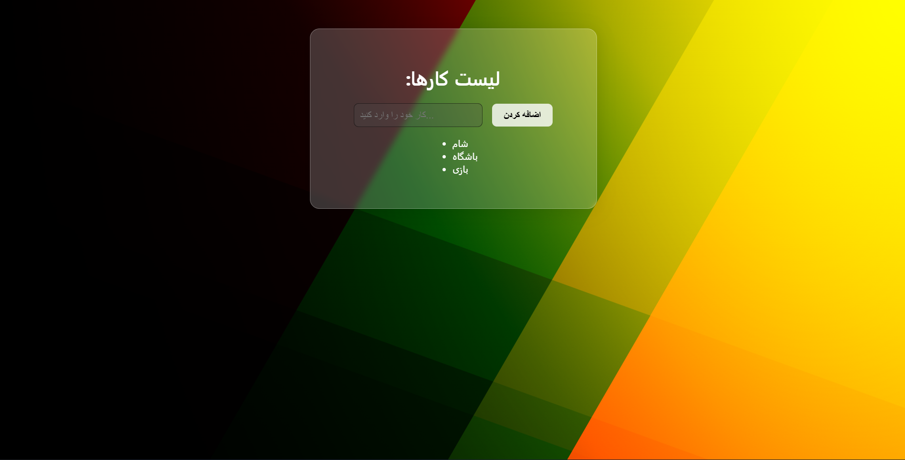

# Simple React TodoList Project with Virtual DOM

This is a **small React project** created as my first step into React development. 
It uses the **Virtual DOM** to efficiently update the UI. 
- Simple and educational project
- Uses Virtual DOM for better performance
- My first small React project

## Project Preview 
 

## Installation and Running 

1. Clone the repository:
```
   git clone https://github.com/KA3RAM/mini-Todo-List.git
```
2. Navigate into the project folder:
```
cd mini-Todo-List
```
3. Install dependencies:
```
npm install
```
4. Run the project:
```
npm start
```


Hope you enjoy the project!
